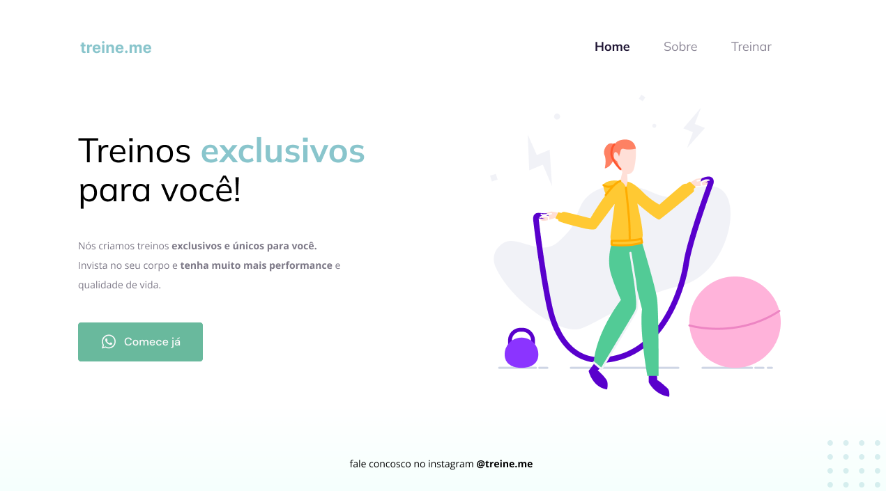

## 🖥️ Projeto

Projeto de um site simples para vendas e divulgação.

## 🚀 Tecnologias

Esse projeto foi desenvolvido em aula na Rocketseat com as seguintes tecnologias:

- HTML
- CSS
- Git e Github

